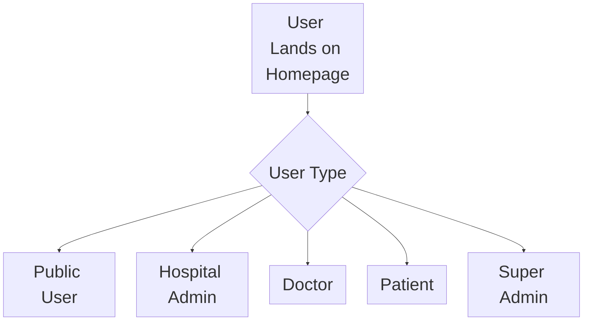
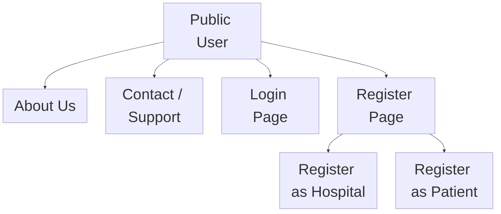
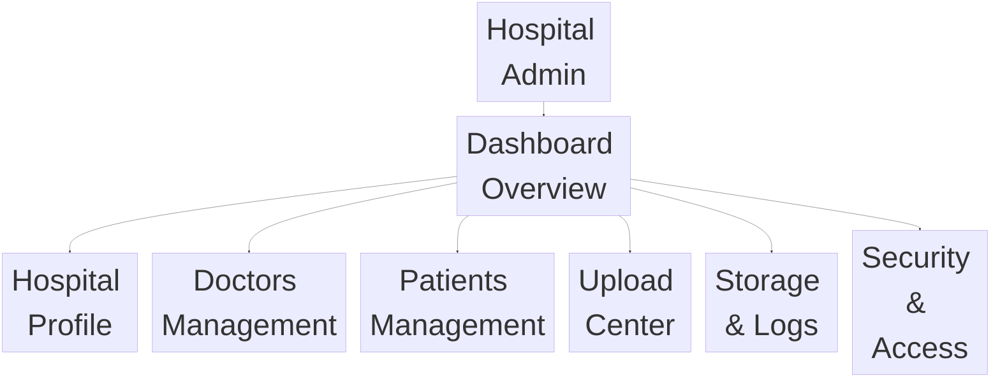

# Medical-Records-Management-

A medical record managment platform for hospitals, doctors and patients.

# For Local Development:

If you want to preview Mermaid diagrams locally before pushing to GitHub:

VS Code: Install the "Markdown Preview Mermaid Support" extension

# Navigation Flows

### Main Navigation Flow

### Public User Flow

### Hospital Admin Flow

