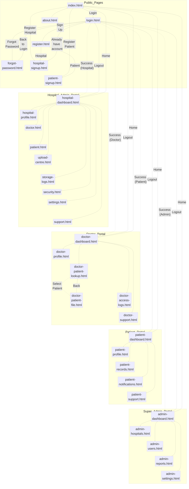

```mermaid
%%{init: {'themeVariables': { 'fontSize': '100px'}, 'flowchart': {'nodeSpacing': 50, 'rankSpacing': 150}}}%%
flowchart TD
    %% Nodes
    subgraph Public_Pages
        Index["index.html"]
        Login["login.html"]
        Register["register.html"]
        ForgotPW["forgot-password.html"]
        About["about.html"]
        HospSignup["hospital-signup.html"]
        PatSignup["patient-signup.html"]
    end

    subgraph Hospital_Admin_Portal
        HDash["hospital-dashboard.html"]
        HProfile["hospital-profile.html"]
        HDoctor["doctor.html"]
        HPatient["patient.html"]
        HUpload["upload-centre.html"]
        HLogs["storage-logs.html"]
        HSecurity["security.html"]
        HSettings["settings.html"]
        HSupport["support.html"]
    end

    subgraph Doctor_Portal
        DDash["doctor-dashboard.html"]
        DProfile["doctor-profile.html"]
        DLookup["doctor-patient-lookup.html"]
        DFile["doctor-patient-file.html"]
        DLogs["doctor-access-logs.html"]
        DSupport["doctor-support.html"]
    end

    subgraph Patient_Portal
        PDash["patient-dashboard.html"]
        PProfile["patient-profile.html"]
        PRecords["patient-records.html"]
        PNotifs["patient-notifications.html"]
        PSupport["patient-support.html"]
    end

    subgraph Super_Admin_Portal
        ADash["admin-dashboard.html"]
        AHospitals["admin-hospitals.html"]
        AUsers["admin-users.html"]
        AReports["admin-reports.html"]
        ASettings["admin-settings.html"]
    end

    %% Vertical Stacking (Invisible Edges within subgraphs)
    Index ~~~ About
    Login ~~~ Register ~~~ ForgotPW
    HospSignup ~~~ PatSignup

    HDash ~~~ HProfile ~~~ HDoctor ~~~ HPatient ~~~ HUpload ~~~ HLogs ~~~ HSecurity ~~~ HSettings ~~~ HSupport
    DDash ~~~ DProfile ~~~ DLookup ~~~ DLogs ~~~ DSupport
    PDash ~~~ PProfile ~~~ PRecords ~~~ PNotifs ~~~ PSupport
    ADash ~~~ AHospitals ~~~ AUsers ~~~ AReports ~~~ ASettings

    %% Section Separation (Stacking Portals Vertically)
    PatSignup ~~~ HDash
    HSupport ~~~ DDash
    DSupport ~~~ PDash
    PSupport ~~~ ADash

    %% Public Navigation
    Index -->|"Login"| Login
    Index -->|"Register Hospital"| HospSignup
    Index -->|"Register Patient"| PatSignup
    About --> Index

    Login -->|"Forgot Password"| ForgotPW
    Login -->|"Sign Up"| Register
    ForgotPW -->|"Back to Login"| Login

    Register -->|"Hospital"| HospSignup
    Register -->|"Patient"| PatSignup

    HospSignup -->|"Already have account"| Login

    %% Login Redirects (Conceptual)
    Login -.->|"Success (Hospital)"| HDash
    Login -.->|"Success (Doctor)"| DDash
    Login -.->|"Success (Patient)"| PDash
    Login -.->|"Success (Admin)"| ADash

    %% Hospital Admin Navigation (Sidebar links present on all pages)
    HDash <--> HProfile
    HDash <--> HDoctor
    HDash <--> HPatient
    HDash <--> HUpload
    HDash <--> HLogs
    HDash <--> HSecurity
    HDash <--> HSettings
    HDash <--> HSupport

    %% Doctor Navigation (Sidebar links present on all pages)
    DDash <--> DProfile
    DDash <--> DLookup
    DDash <--> DLogs
    DDash <--> DSupport
    DLookup -.->|"Select Patient"| DFile
    DFile -->|"Back"| DLookup

    %% Patient Navigation (Sidebar links present on all pages)
    PDash <--> PProfile
    PDash <--> PRecords
    PDash <--> PNotifs
    PDash <--> PSupport

    %% Super Admin Navigation (Sidebar links present on all pages)
    ADash <--> AHospitals
    ADash <--> AUsers
    ADash <--> AReports
    ADash <--> ASettings

    %% Common Links (Navbar/Logout)
    classDef common fill:#f9f,stroke:#333,stroke-width:2px;

    %% All internal pages link to Login (Logout) and Index (Home)
    HDash -->|"Logout"| Login
    DDash -->|"Logout"| Login
    PDash -->|"Logout"| Login
    ADash -->|"Logout"| Login

    HDash -->|"Home"| Index
    DDash -->|"Home"| Index
    PDash -->|"Home"| Index
    ADash -->|"Home"| Index
```
